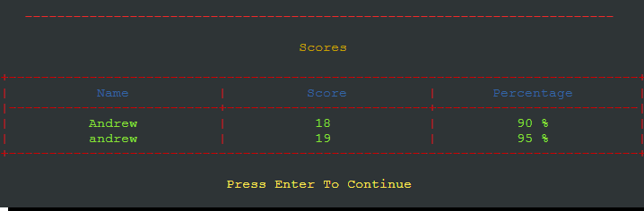
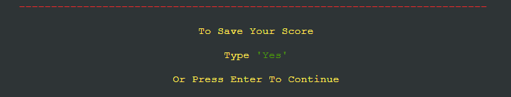

# Riddles

[_Click here to view live deployment_](https://ac-riddles.herokuapp.com/)

This featured low level Python game that deploys to a console.

The game consists of 20 riddles that have multiple choice answers for you to pick from.

The riddles are imported from a google sheet worksheet that contains 50 riddles with the answers.

The game has a function that can save the player scores upon the request of the player and the scores are saved to a worksheet.

It has instructions that are seen by the user upon loading making it easy to understand how the game works 

# _Content Menu_

1. [Features](#features)
    1. [How To Play](#how-to-play)
    2. [Game Elements](#game-elements)
        1. [Welcome](#1---welcome)
        2. [Player](#2---player)
        3. [How To Play](#3---how-to-play)
        4. [Saved Score Viewing](#4---saved-score-viewing)
        5. [Displayed Riddles](#5---displayed-riddles)
        6. [Correct Answer](#6---correct-answer)
        7. [Incorrect Answer](#7---incorrect-answer)
        8. [Invalid Enterys](#8---invalid-enterys)
        9. [Final Score](#9---final-score)
        10. [Top Score](#10---top-score)
        11. [Saving Scores](#11---saving-scores)
        12. [Play Again](#12---play-again)
        13. [Game End](#13---game-end)
    3. [Data-Storage](#data-storage)
    4. [Implemented Features](#implemented-features)
    5. [Features to be Implemented](#features-to-be-implemented)
2. [Design](#design)
3. [Bugs](#bugs)
4. [Testing](#testing)
5. [Validation](#validation)
6. [Technologies](#technologies)
7. [Depolyment](#deployment)
    1. [Version Control](#1---page-deployment)
    2. [Page Deployment](#2---page-deployment)
    3. [Cloning Repository](#3---cloning-repository)
8. [Credits](#credits)

# _Features_

## _How To Play_
    
 * The player will be prompted to enter there name which they can skip.
 
 * Skipping the name input will stop the user from saving there score.
 
 * The player can display scores that have been saved.
 
 * This is a multiple choice game prompting the player to select the corret answer for the riddles from a choice of 3 answers.
 
 * The idea of the game is to get as many correct as possible.
 
 * The player will be able to save there score at the end of the game(if name has been entered)
 
 * There is a play again prompt allowing the player to play again.

## _Game Elements_

### _1 - Welcome _

 * is a simple Welcome to riddles header

### _2 - Player_

 * After the welcome header the player will be prompt to enter there mane or press enter to continue.
 
 * This then take the player to the [How To Play](#3---how-to-play) section.

### _3 - How To Play_

 * This explains to the player How to play the game.

 * This is outputted as soon as the player has either entered ther name or pressed enter to skip.

 * The has a prompt saying 'Press Enter To Continue' and this will take the palyer to [See Saved Scores](#4---saved-score-viewing) prompt.

### _4 - Saved Score Viewing_

 * The player is prompt with asking to view the saved scores and asked to type 'Yes', 'Or Press Enter To Continue'. 

 * Typing yes will Show the stored scores and display this table below.

 * Pressing enter then the player is taken to the [Riddles](#5---displayed-riddles)

 * If the player is at the end of the game then pressing enter will take then to [Play Again](#11---play-again) to allow the player to either exit or restart.

 * This table will show if the user has requested viva the prompt.

 * It shows the name, score and the preceentage of each player that has saved scores.

 * If the player has chosen to save there score at the end of the game, there is another prompt to allow then to view the scores.

 * At the bottom of there table there is a message saying 'Press Enter To Contiune'.

 * If the player is at the begining of the game this will take the player to the [Riddles](#5---displayed-riddles) to begin playing.

 * If the player is at the end of the game then this will take the player to [Play Again](#11---play-again) to allow the player to either exit or restart.

### _5 - Displayed Riddles_

 * The player will be Shown a message saying 'Good Luck' before the first riddle only.

 * Then the player will be pressented with the first riddle.

 * This shows The player What riddle there are currently on first.

 * Then Shows The riddle.

 * Then Shows The options to choose from.

 * Then the player is prompr to Type 'A', 'B' or 'C'.

 * Once the player has answered the user will be prompted with the correct output.

 * If the player answers correctly then ['You Answered Correctly'](#6---correct-answer) message is show with the current score.

 * If the player answers incorrectly then ['Sorry Wrong Answer'](#6---correct-answer) message is show with the current score.

 * If the player answers enters an incorrect value then th you ['Incorrect Value'](#6---correct-answer) message is show a prompt saying enter A, B or C. 

 * This will be the same steps untill the 20th riddle is answered.

### _6 - Correct Answer_

 * If the player answers the riddle correctly then this 'You Answered Correctly' message will show.

 * The players score will increase by one point and display their currnt score below.

### _7 - Incorrect Answer_

 * If the player answers the riddle incorrectly then this 'Sorry Wrong Answer' message will show.

 * The players score will not change but will display their currnt score below.

### _8 - Invalid Enterys_

 * Whilst the player is answering the riddles and does not enter 'A' or 'a', 'B' or 'b', 'C' or 'c'

    this incorrect value message will show and prompt the user to enter A, B or C.

### _9 - Final Score_

 * After the play has answered all the riddles this final score message will show.

 * The final score message will show the player their score with an accuracy percentage aswell.

 * IF a player get all 20 riddles correct the will be pressented with a 'CONGRATULATIONS (Players Name) YOU ARE A RIDDLE MASTER' message.

 
 * Then the user will be prompted with [To Save Your Score](#10---saving-scores)* or [See Saved Scores](#4---saved-score-viewing).

    *(only displays when player provides a name, is shown before 'See Saved Scores'  if name is provided).
    

### _10 - Saving Scores_
 
 * This is option only shows whan a player has provided a name. 

 * if a name is not given the use will be prompted with the [See Save Scores](#4---saved-score-viewing). (See Above For Details).

 * If the player had given a name then they will be asked if they would like to save there score and asked to type 'Yes', 'Or Press Enter To Continue'.

 * If the user Types Yes then The 'Uploading Score" message will show first and once the proccess has finished the 'Successfully Added' message will appear.

 * Then the user will be prompted with the [See Save Scores](#4---saved-score-viewing). (See Above For Details).

 * If the player presses enter then this process will be skipped and the user will be prompted with the [See Save Scores](#4---saved-score-viewing). (See Above For Details).

### _11 - Play Again_

 * The player will be prompt with 'Play Again' message and asked to type 'Yes', 'Or Press Enter To Conintue'.

 * If the player types yes the the game will loop back to the how to play screen so the player can start again.

 * If the plyer presses enter to continue the game will procceed to end.

### _12 - Game End_

 * After the player has pressed enter not to play again, this 'Thank You For Playing' message is deployed.

## _Data Storage_
 
 * The data for this game is exchanged using google sheets

 * The riddles are generated from a worksheet riddles that holds all the riddles, answer options and correct answer indicater.

 * The player scores are saved to another worksheet scores that then is inputted back to the score table.

## _Implemented Features_

 * Has difreent colour outputs so show the different types of information shown to the player.

 * has a save funtion to save the players scores.

 * Has a function to resart the game.

 * Easily able to implent more riddles buy inputting them to the google sheet worksheet

## _Features to be Implemented_

 * Change the score table from showing all saved scores to the top 10 higest scores.

# _Design_
 
 * This flow chart shows how the game responds within the different sections.

 * This flow chart will Help through the testing to determine whether the game responds as it should.

 

# _Bugs_

 * Through testing there are no current known bugs within the game
 
 * Throught development there was a bug of same questions being show more than once within one game sequence
    * which was fixed using an if statment to check if a generated item had been used already.

# _Testing_

## _1 - _

 * 

# _Validation_

 * This game passes through the [Code Institute PEP8](https://pep8ci.herokuapp.com/) Validator with no errors.

# _Technologies_

 * Python is the main programming language to produce the game.

 * [LucidChart](https://www.lucidchart.com/pages/) used to create the flow chart showing the game's functionality and flow.

 * [GitHub](https://www.github.com) was used to hold the game repository files.

 * [Gitpod](https://www.gitpod.io) was used for the coding environment.

 * [Heroku](https://www.heroku.com) was used to deploy the game to the web.
 
 * [NHC Debut Video](https://www.nchsoftware.com/capture/download-now.html?ns=true&kw=nch%20debut%20video&gclid=Cj0KCQjwxYOiBhC9ARIsANiEIfaBgkFY226We0Niciqf_go8kAI_hYrSRyhBh2FvxDuEqUfzJi1j0YoaAtjGEALw_wcB) Capture used to screen recored the game play for gif.

 * To create the gif [ezgif.com](https://www.ezgif.com) was used

# _Deployment_

## _1 - Version Control_

 Verion controle was maintained using GIT within GitPod to push code to the GitHub repository

 * From the Gitpod terminal use "git add ." which tells git you would like to make changes/updates to the files.

 * Then use "git commit -m " with a comment, this will commit the changes and update the files.

 * Then using the "git push" command this will push the committed changes to your GitHub repository.

## _2 - Page Deployment_

 * Go to Heroku and log in

 * click "New" to create a new app from the dashboard

 * Choose app name and select your region, press "Create app".

 * Go to "Settings" and navigate to Config Vars.

 * Add Config Vars. 
    * This app used two 
        * One for the credentials to allow access to the google sheets. KEY = CREDS : VALUE = CREDS.json content.
        * Second KEY = PORT : VALUE = 8000.
 
 * Add buildpacks Python and NodeJS in this order.
 
 * Now go to the Deploy tab.
 
 * Scroll Down to Deployment Method and select GitHub.
 
 * Select repository to be deployed and connect to Heroku.
 
 * Now Scroll down to depoly : 
    * Option 1 is selecting Automatic deploys (Will Update Automaticly when every git push to the repository).
    * Option 2 is selecting Manual deploy (Needs to me redeployed after every change manually via Heroku deploy tab).

 Visit the live deployment [HERE](https://ac-riddles.herokuapp.com/).

## _3 - Cloning Repository_

 * To clone the repository for download or use within your GitHub head-over to this [link](https://github.com/git-guides/git-clone) 

# _Credits_

 * I used Rich from this link here for References [rich.readthedocs](https://rich.readthedocs.io/en/latest/index.html)

 * The use of the Code Institute love_sandwiches walk through project for the linking of the google sheets

 * I used [python.org](https://www.python.org/) for References for the Pyhton code and functionality

 * I used [w3schools](https://www.w3schools.com/python/default.asp) for References for the Pyhton code and functionality

 * I used [stackoverflow](https://stackoverflow.com/) for References for the Pyhton code and functionality