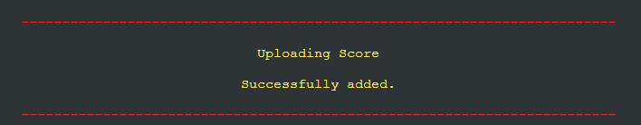
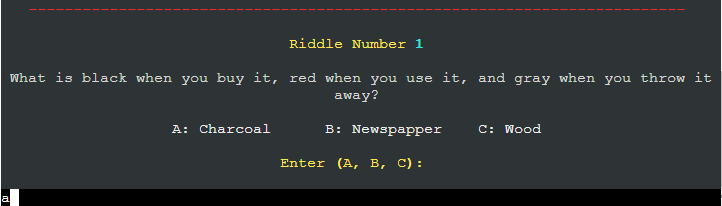

# Riddles

[_Click here to view live deployment_](https://ac-riddles.herokuapp.com/)

This featured low level Python game that deploys to a console.

The game consists of 20 riddles that have multiple choice answers for you to pick from.

The riddles are imported from a google sheet worksheet that contains 50 riddles with the answers.

The game has a function that can save the player scores upon the request of the player and the scores are saved to a worksheet.

It has instructions that are seen by the user upon loading making it easy to understand how the game works 

# _Content Menu_

1. [Features](#features)
    1. [How To Play](#---how-to-play)
    2. [Game Elements](#game-elements)
        1. [Welcome](#1---welcome)
        2. [Player](#2---player)
        3. [How To Play](#3---how-to-play)
        4. [Saved Score Viewing](#4---saved-score-viewing)
            1. [View Saved Score](#1---view-saved-score)
            2. [Saved Score Table](#1---saved-score-table)
        5. [Saving Scores](#5---saving-scores)
            1. [Save Score](#1---save-score)
            2. [Saved Score Confirmation](#2---saved-score-confirmation)
        6. [Displayed Riddles](#6---displayed-riddles)
        7. [Correct Answer](#7---correct-answer)
        8. [Incorrect Answer](#8---incorrect-answer)
        9. [Invalid Enterys](#9---invalid-enterys)
        10. [Final Score](#10---final-score)
        11. [Game End](#11---game-end)
    7. [Implemented Features](#implemented-features)
    8. [Features to be Implemented](#features-to-be-implemented)
2. [Design](#design)
3. [Bugs](#bugs)
4. [Testing](#testing)
5. [Validation](#validation)
6. [Depolyment](#deployment)
    1. [Version Control](#1---page-deployment)
    2. [Page Deployment](#2---page-deployment)
    3. [Cloning Repository](#3---cloning-repository)
7. [Credits](#credits)
    1. [Code](#2---code)

# _Features_

## _1 - How To Play_

## _2 - Game Elements_

### _1 - Welcome _

 * 

### _2 - Player _

 * 

### _3 - How To Play_

 * 

### _4 - Saved Score Viewing_

#### _1 - View Saved Score_

 * 

#### _1 - Saved Score Table_

 * 

### _5 - Saving Scores_

#### _1 - Save Score_

 * 

#### _2 - Saved Score Confirmation_

 * 

### _6 - Displayed Riddles_

 * 

### _7 - Correct Answer_

 * 

### _8 - Incorrect Answer_

 * 

### _9 - Invalid Enterys_

 * 

### _10 - Final Score_

 * 

### _11 - Game End_

 * 

## _Implemented Features_
 
 * 

## _Features to be Implemented_

 * 

# _Design_
 
 * 
 

# _Bugs_

 * 

# _Testing_

## _1 - _

 * 

# _Validation_

 * 

# _Deployment_

## _1 - Version Control_

 * From the Gitpod terminal use "git add ." which tells git you would like to make changes/updates to the files.
 * Then use "git commit -m " with a comment, this will commit the changes and update the files.
 * Then using the "git push" command this will push the committed changes to your GitHub repository.

## _2 - Page Deployment_

 * 

 Visit the live deployment [HERE](https://ac-riddles.herokuapp.com/).

## _3 - Cloning Repository_

 * To clone the repository for download or use within your GitHub head-over to this link https://github.com/git-guides/git-clone

# _Credits_

# _1 - Code_

 * 
